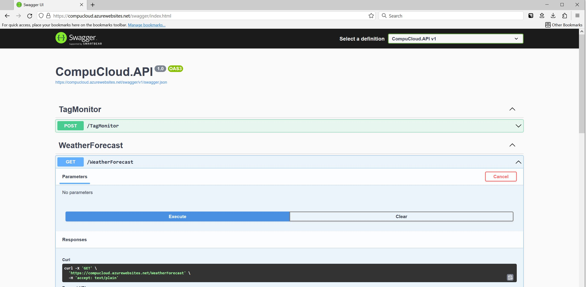
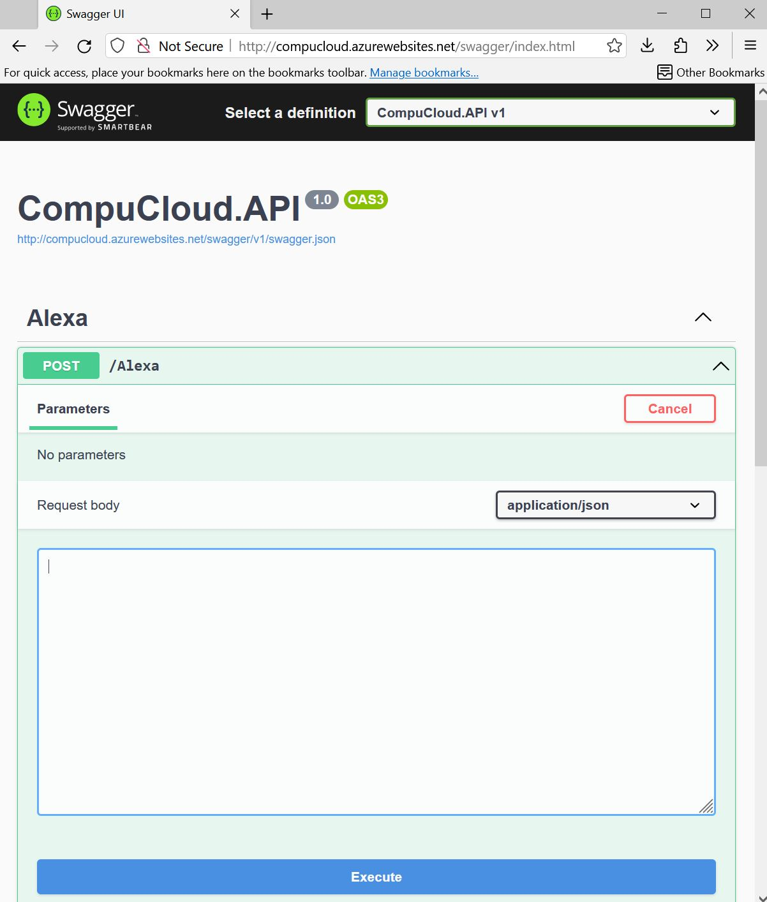

# CompuCloud
Computrol Cloud web api interface for monitoring of PLCs. This includes an interface to Amazon Alexa.

In a nutshell, the Computrol Swiss Army Knife tag monitor (or even the Computrol Alarm Service Monitor) runs in the background out on the factory floor and sends changes to tag values up to "CompuCloud", an api that runs on the web. CompuCloud stores these PLC tag values in a database, and makes them available to applications such as Amazon Alexa, or web or mobile app applications we create.

## Alexa CompuCloud voice command
```
"Alexa, ask computrol cloud to read tag a from plc tata tea"
```

#
Below is a table of test "friendly tag names" mapped to Tata Tea PLC tags

<table>
   <tr><td><b>friendly name</b></td><td><b>tag name</b></td></tr>
   <tr><td>A</td><td>CTask_JFile[3].Item[0].Actual</td></tr>
   <tr><td>B</td><td>CTask_JFile[3].Item[0].Code</td></tr>
   <tr><td>C</td><td>CTask_JFile[3].Item[0].Request</td></tr>
   <tr><td>D</td><td>CTask_JFile[3].Item[0].Status.Complete</td></tr>
</table>

#

**Open the Alexa Development Console**

https://developer.amazon.com/alexa/console/ask

**Architecture**

[Compu Cloud On Azure](docs/CompuCloudOnAzure.md)

CompuCloud is hosted on Microsoft Azure at:

https://compucloud.azurewebsites.net/swagger/index.html



**Design and Architecture**

[CompuCloud Block Diagrams](docs/CompuCloud.md)


## Testing Alexa using CompuCloud running locally on a Developer Machine
[See this tutorial](docs/HowToTestAlexaLocally.md)

## Testing Alexa using CompuCloud running on Microsoft Azure

Browse to: 

http://compucloud.azurewebsites.net/swagger/index.html

Paste in [this sample Alexa JSON payload](docs/TestAlexaPayload.md) into the Swagger Alexa Request Body.

