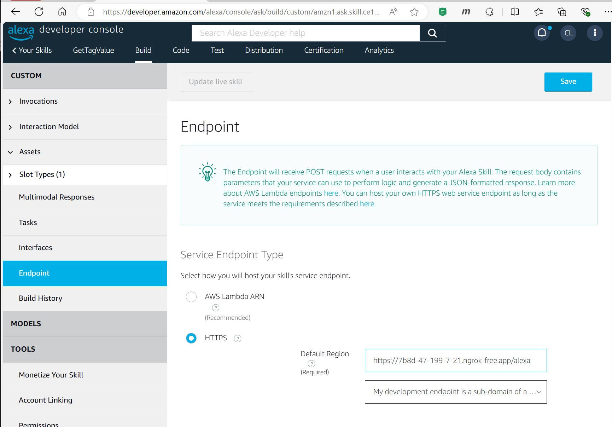

# How to Test the Alexa CompuCloud API locally

## 1 - Run the CompuCloud project
Copy the PORT that the web api is running under

In the example below, after running project, the swagger page shows that the web api is running under port 7124

https://localhost:7124/swagger/index.html

> [!IMPORTANT]
>Be sure to run the visual studio project with https (NOT http), otherwise the CompuCloud api controller will not respond to the request from the Alexa Developer console.

## 2 - Run NGrok

When starting the ngrok agent, use the full upstream service address. 

In this example, at the command prompt run: 

```
ngrok http https://localhost:7124
```

## 3 - You will see the following

ngrok                        Ctrl+C to quit

Full request capture now available in your browser: https://ngrok.com/r/ti  

Session Status                online         

Account                       chris (Plan: Free)    

Update                        update available (version 3.10.0, Ctrl-U to update)   

Version                       3.8.0         

Region                        United States (us)     

Latency                       46ms         

Web Interface                 http://127.0.0.1:4040  

***Forwarding***                   https://bda0-47-199-7-21.ngrok-free.app -> https://localhost:7124/     

Connections                   ttl     opn     rt1     rt5     p50     p90 1       0       0.00    0.00    111.00  111.00                                                                                                                                                                    

HTTP Requests                                                                                                           
                                                                                                                                                                                                                              
GET /weatherforecast           200 OK                                                                                   
GET /weatherforecast           200 OK                 

## 4 - Copy the Forwarding address, and append the AlexaHello controller end point to it:

https://bda0-47-199-7-21.ngrok-free.app/alexa


## 5 - Open the Alexa Development Console

https://developer.amazon.com/alexa/console/ask

### Skill Name
GetTagValue

## 6 - Paste the address from step 4 into the Alexa Developer Console End Point Default Region



## 7 - Alexa command:   

```
"Alexa, ask computrol cloud to read tag a from plc tata tea"
```

Below is a table of test "friendly tag names" mapped to Tata Tea PLC tags

<table>
   <tr><td>friendly name</td><td>tag name</td></tr>
   <tr><td>a</td><td>CTask_JFile[3].Item[0].Code</td></tr>
   <tr><td>b</td><td>CTask_JFile[3].Item[0].Request</td></tr>
   <tr><td>c</td><td>CTask_JFile[3].Item[0].Actual</td></tr>
</table>